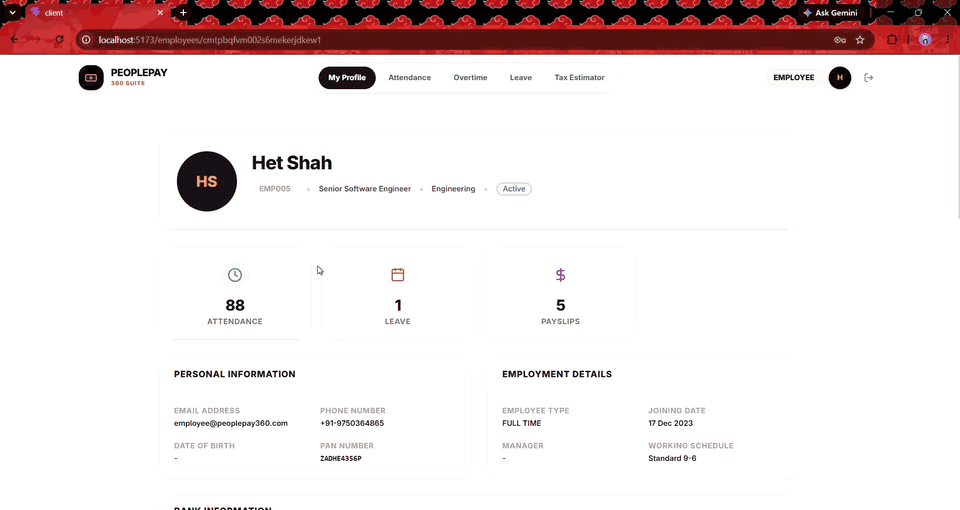

# Feel

**Alt + right-click any element in your React app and see the whole stack behind it** —
down to the line of code, the API route, the backend handler, the SQL and the tables.

[](https://github.com/Nirbhay71/Feel-your-project/actions/workflows/ci.yml)
[](https://www.npmjs.com/package/@feel-dev/vite-plugin)
[](LICENSE)

Works with **React on Vite or Next.js**, **Express**, **Postgres or MySQL**, **Prisma** and **Drizzle**.
Dev only, two-minute setup, nothing added to production.

<!-- TODO: demo GIF here — Alt + right-click on a chart → the panel with the full stack
 -->

## Why

More and more apps are generated or "vibe coded" — with Cursor, Claude Code, v0, Bolt.
They work, but nobody quite knows what happens under the hood. Feel answers
"where does *this* come from?" for any piece of UI, without reading the whole codebase:

```
The "Sales this week" chart (from the demo app)
  component   Dashboard › SalesChart                     SalesChart.jsx:11
  frontend    ⇢ @tanstack/react-query ⇢ fetchSales        api.js:13
  API         GET /api/sales
  backend     inline handler                             server/routes/sales.js:7
  SQL         SELECT … FROM orders …                     sales.js:8 · 10 ms · 7 rows
  tables      orders → users, products · ← notifications · changed 2m ago
```

Every step opens the actual code. Calls a component *could* make but hasn't yet
(buttons nobody clicked) show up too, found from the code alone.

## What you get

- **Component chain** from React's own tree, with the exact JSX line of each usage
- **Data flow** per component, as a list or a graph: frontend functions → API route →
  backend handler → SQL queries → tables → related tables
- **Code viewer** at every step, and "Open in editor"
- **Possible calls**: static analysis of calls not made yet (dashed in the graph)
- **ORMs**: Prisma and Drizzle queries show their SQL, tables and the line in your code
  that asked for them — also for calls not made yet
- **Database view** (Postgres): columns, keys, foreign keys both ways, and — opt-in —
  every change, linked to the request and component that caused it
- **Dev only**: nothing is added to production builds

## Quick start

### React + Vite

```bash
npm install -D @feel-dev/vite-plugin     # in your frontend
npm install -D @feel-dev/node            # in your backend
```

```js
// vite.config.js
import feel from '@feel-dev/vite-plugin';
export default defineConfig({
  plugins: [feel({ database: process.env.DATABASE_URL }), react()], // database is optional
});
```

```js
// first line of your server entry
import '@feel-dev/node/register';      // or: require('@feel-dev/node/register')
```

Run your app as usual, then **hold Alt** (outlines) and **Alt + right-click** (panel).
Full setup guide: [packages/vite-plugin/README.md](packages/vite-plugin/README.md).

### Next.js

```bash
npm install -D @feel-dev/next
```

```js
// next.config.mjs
import { withFeel } from '@feel-dev/next';
export default withFeel({ /* your config */ }, { database: process.env.DATABASE_URL });
```

```js
// instrumentation.js — route handlers' SQL
export async function register() {
  if (process.env.NODE_ENV === 'development' && process.env.NEXT_RUNTIME === 'nodejs') {
    await import('@feel-dev/next/register');
  }
}

// instrumentation-client.js — the browser side
import '@feel-dev/next/client';

// app/%5F%5Ffeel/[...path]/route.js — Feel's agent (the folder name is "__feel", escaped)
export { GET, POST } from '@feel-dev/next/agent';
```

Works with Turbopack (`next dev`) and webpack (`next dev --webpack`), Next 16+.
Full guide: [packages/next/README.md](packages/next/README.md).

## Supported

| | |
|---|---|
| Frontend | React 19 (dev mode) on Vite — tested with Vite 7 and 8 — or on **Next.js** App Router (16+; Turbopack or webpack) |
| Data fetching | `fetch`, axios, `axios.create` instances (incl. interceptors), wrapper functions, custom hooks, API objects (`userApi.getAll()`), React Query, SWR |
| Imports | relative, Vite `resolve.alias`, tsconfig/jsconfig `paths` + `baseUrl`, `package.json` `"imports"` |
| Backend | Express 4 and 5 — ES modules or CommonJS, routers, `app.use` mounts, controllers; Next.js Route Handlers (`app/**/route.ts`) and Pages Router API routes (`pages/api/**`) |
| Database | Postgres: queries per request, tables, structure, change history — through `pg`, **Prisma** (7, or 6 with `@prisma/adapter-pg`) or **Drizzle** (`drizzle-orm/node-postgres`) |
| | **MySQL / MariaDB**: queries per request, tables, timing and the line in your code — through `mysql2` (callbacks or `mysql2/promise`, pools, `getConnection`, transactions) or **Drizzle** (`drizzle-orm/mysql2`) |
| Other ORMs on `pg` | Knex, Sequelize, TypeORM, …: SQL and tables per request; the line in your code when the ORM keeps it on the stack |
| Layout | frontend and backend in one folder or side by side (`client/` + `server/`) |

## Not yet

- **Prisma's Rust engine** (Prisma 6 and older without a driver adapter) — its queries don't go through `pg`
- **MySQL table view and change history** — MySQL queries and tables show per request, but the table view is Postgres only
- **Other MySQL paths**: the `mysql` and `mariadb` drivers, Prisma on MySQL, and prepared statements made with `connection.prepare()`; `PoolCluster` is best effort (a query's line may be missing)
- **SQLite** — the static side understands Drizzle's SQLite tables, the runtime side doesn't yet
- **Next.js beyond Route Handlers**: Server Actions, data fetched inside Server Components, `middleware.ts` / `proxy.ts`, the edge runtime, `output: 'export'`, and Next before 16 (Server Components still get their DOM tags; a Server Component that renders a client one isn't in its chain)
- Create React App, Vue, Svelte — Feel needs React on Vite or Next.js today
- **Supabase** (browser talks to the database directly)
- React 18 and older show a simpler, DOM-based component chain

Want one of these? See [CONTRIBUTING.md](CONTRIBUTING.md) — PRs very welcome.

## How it works

| Package | Runs in | Does |
|---|---|---|
| [`@feel-dev/vite-plugin`](packages/vite-plugin) | Vite | tags every JSX element with its file:line, tags components, injects the client |
| [`@feel-dev/next`](packages/next) | Next.js | the same for Next (a loader for Turbopack and webpack), wraps route handlers, serves the agent from a route |
| [`@feel-dev/client`](packages/client) | browser | Alt + right-click, React fiber chain, captures fetch/XHR/axios with stack traces, the panel |
| [`@feel-dev/agent`](packages/agent) | Vite / Next dev server | maps stacks through sourcemaps, builds the call graph, static analysis, reads Postgres |
| [`@feel-dev/node`](packages/node) | your backend | reports the Express route or Next route handler, the handler and SQL of each request (raw `pg`/`mysql2`, Prisma, Drizzle) in a response header |

## Try the demo

```bash
npm install
npm run db      # Postgres in Docker on :5433
npm run demo    # API :3001 + app :5173
```

## Troubleshooting

**`npm install` reports `ERESOLVE` for Next.js.** `@feel-dev/next` needs Next.js 16 or newer.
Upgrade the app with `npx @next/codemod@canary upgrade latest`, then install again.

**Alt + right-click does nothing.** Feel runs in development with React 19. In Vite, put `feel()`
before `react()` in the plugins list. In Next.js, use `next dev` and include the `withFeel` config,
`instrumentation-client.js`, and the `app/%5F%5Ffeel/[...path]/route.js` route.

**The Next.js agent route returns 403.** Requests from another device need its IP in
`allowedAddresses`; a non-local host may also need `allowedHosts` or Next.js `allowedDevOrigins`.

**The Next.js agent route returns 404.** Feel only serves the route under `next dev`. Check that
`app/%5F%5Ffeel/[...path]/route.js` exports `GET` and `POST` from `@feel-dev/next/agent`.

**SQL is missing for Prisma.** Prisma 6 and older need a driver adapter for Feel to see Postgres
queries, such as `@prisma/adapter-pg`. Prisma's Rust engine does not send queries through `pg`.

## Tried it? Tell me

Feel is young, and every real app finds something new. If you tried it — whether it
worked or not — please [open an issue](https://github.com/Nirbhay71/Feel-your-project/issues/new)
with your stack (Vite or Next, Express version, database, ORM). A star helps others find it.

## Contributing & security

- [CONTRIBUTING.md](CONTRIBUTING.md) — setup, code layout, tests
- [SECURITY.md](SECURITY.md) — what Feel can access, and how to report issues privately

## License

[MIT](LICENSE)
